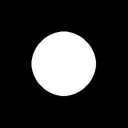

# What is this?
1. Unstable.
2. A single-header software rendering library.
You create sr_surface types which you can draw bytes to.
The simple circle- line- and rectangle-drawing function's assume a single pixel to be represented by a single byte.
How that byte is interpreted, visually or otherwise, is up to you to decide and implement.
A common approach might be to have the byte represent an index into a palette.

# Using the library
Add the header to your project, and include it wherever it is needed.
In exactly one of the source files; define SR_IMPLEMENTATION

Example:
```c
#define SR_IMPLEMENTATION
#include "sr.h"

#define WIDTH 256
#define HEIGHT 256

#define WHITE 255
#define BLACK 0

void ppm_save(const char* filename, sr_surface *surf) {
    FILE *f = fopen(filename, "wb");
    if (!f) {
        perror("file could not be opened");
    }

    fprintf(f, "P6\n%d\n%d\n255\n", surf->width, surf->height);

    for ( size_t y = 0; y < surf->height; y++ ) {
        for ( size_t x = 0; x < surf->width; x++ ) {
            unsigned char c = sr_get_pixel(surf, x, y);
            unsigned char color[3] = {c, c, c};
            fwrite(color, sizeof(c), 3, f);
        }
    }
    fclose(f);
}

int main() {
    sr_surface *screen = &sr_surface_value(WIDTH, HEIGHT);
    sr_fill(screen, BLACK);

    int x = 127;
    int y = 127;
    int radius = 64;

    sr_circle_fill(screen, WHITE, x, y, radius);
    ppm_save("example.ppm", screen);

    return 0;
}
```



# Extending
When extending the library, I use the test.c program by running the .r.sh script.
Tests will be highlighted in either red or green depending on the result. When tests fail, a ppm image will also be generated for easier debugging.
